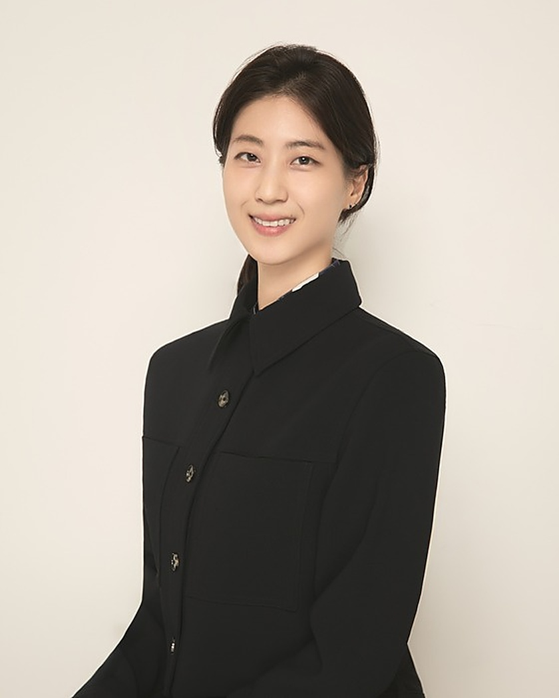

  <h1>Stella Yeayeun Park</h1>
  
Assistant Professor, Sogang Business School, Sogang University

  

    
  

  

Stella Yeayeun Park is an Assistant Professor of Accounting at Sogang Business School, Sogang University. She holds a Ph.D. in Accounting from the Wharton School of the University of Pennsylvania, and Bachelor's degrees in Computer Science and Economics from Swarthmore College. Prior to joining Sogang in March 2025, she served for three years as an Assistant Professor of Accounting at Singapore Management University.

Park's research broadly relates to disclosure, information processing, and contracting. In particular, her work examines how information held and processed by various market participants influences their strategic behavior, ultimately shaping outcomes in capital markets and the real economy.

Before pursuing her graduate studies, Park worked as a data analyst for two years at the Samuel Zell and Robert Lurie Real Estate Center of the Wharton School.

For inquiries, please feel free to contact her at the email address listed below.

  <strong>Contact</strong> | <a href="mailto:{{ site.data.contact.email }}">{{ site.data.contact.email }}</a>

  <strong>Websites</strong> |
  
  <a href="{{ link.url }}" target="_blank">{{ link.name }}</a>, 
  

